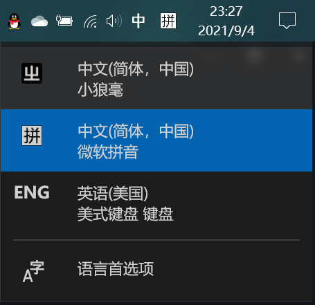
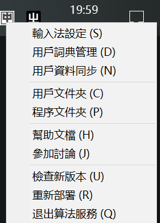
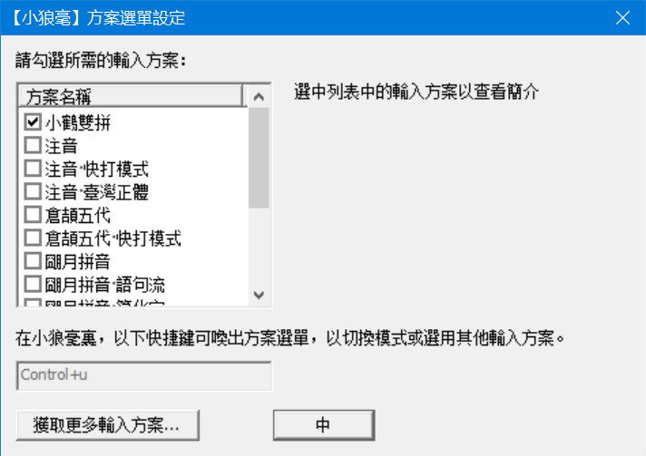
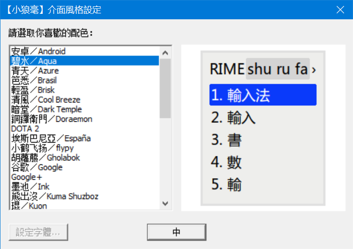
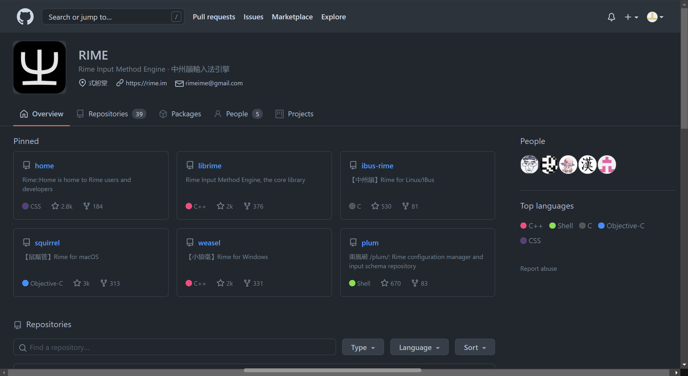

# RIME 之旅

> 输入法是我们每天使用电脑时必不可少的一种工具，这其中有在国内市场份额极大的搜狗、百度输入法，也有诸如讯飞、手心、QQ输入法等有着一定用户数量的精致输入法，但 RIME 绝对是这里面最为独特的一个，如果你是和我一样喜欢折腾电脑的人，不妨试一下这个「自由」的输入法
>
> *PS: 这篇文章也属于我在配置 RIME 过程中的经历，作为之后查阅的手册。当然如果你是刚刚接触 RIME ，我也希望这篇文章可以给予你一些帮助，不再犯我的错误* 

## 什么是 RIME

---

[RIME](https://rime.im) 在官网的Slogan是 `聪明的输入法懂我心意` 。

准确来说，RIME 是作者已经编写并封装好各个组件的一个输入引擎，至于如何构建输入方案便是我们自己的事，只是作者及其它合作者已经设置好了许多份定制好的输入方案，这其中包括了的全拼、双拼、注音等音码方案，以及五笔、郑码、仓颉等形码方案，还有一些特殊的输入方案，如行列30输入法、并击类的宫保（combo）拼音，甚至于有粤语拼音、吴语拼音等方言类的适配，简直强大到无法形容，（也算是让我大开眼见 😂，对我这个原来知道了双拼都要惊讶半天的人产生了很大冲击）

总之，我们可几乎可以在 RIME 中实现输入的所有需求（PS：有词典且会编程的前提下）

接下来，我将会尽量详细的介绍“我眼中”的 RIME 输入法，新入坑的人可以依据[前半部分](#❗❗❗ 新人看这里)安装、简易配置并使用 RIME 输入法(Windows版), [后半部分](#:gear: 配置项详解)将是详细的讲解及我遇到的问题

## ❗❗❗ 新人看这里

### 下载及安装

1. 打开 RIME 官网 <https://rime.im> ，选择上方的 `下载` 

2. 进入下载页面后，选择 Windows 版的小狼毫进行下载

3. 下载完成后，运行安装程序开始安装。在这个过程中，会弹出以下一个窗口，输入语言选择中文（简体）即可，用户文件夹可以选择你喜欢的位置（ Windows 系统默认为 %APPDATA%\ Appdata\Roaming\Rime）

   

4. 完成安装后便可以在 Windows 的语言首选项里找到小狼毫输入法

   

5. 选择 `小狼毫` ，然后将焦点放在一个输入框中，按 ```ctrl + ` ``` （``` ` ``` 键为 `tab` 键上方的键）或 `F4` 进入 `方案选单` ，选择你喜欢的方案

   

6.  你也可以右击语言栏的 `中` 字来打开更详细的菜单

   

7. 点击 `输入法设定` 可以进行简单的输入方案设置与输入法皮肤设置

   

   

8. 如果需要新的输入方案，可以在 `方案選單設定` 中点击 `獲取更多輸入方案` ，可以在 [这里](https:\\github.com\rime) 获得官方支持的方案，如安装双拼方案（在程序中输入 `double_pinyin`）[^1]

   

9. 至此，你已经可以正常的使用小狼毫输入法。当然如果你也和我一样喜欢折腾，可以继续往下看，了解更多小狼毫的设置过程（我在这儿不得不吐槽下 RIME 的官方文档，如果他写的很清楚就不会有以下的文字了 :cry: ）


## :gear: 配置项详解

### 配置文件

#### 文件编码及格式

均采用utf-8编码的YAML文件

#### 位置及组成结构

1. `用户文件夹`

   功能：存放用户自定义的配置文件或从其他地方导入的输入方案、配置文件
   
   结构:
   
   ```
   +--- build 文件夹（存放部署后生成的 *.bin 文件，方便输入法快速调用）
   +--- opencc 文件夹（存放 OpenCC 字型转换配置文件及及字典文件）
   +--- <词典名>.userdb 文件夹（保存用户的输入习惯而创建的 *用户词典* ）
   \__ user.yaml （用户状态信息）
   \__ installation.ymal（安装信息，*同步文件时要用* ）
   \__<输入方案名>.schema.yaml（导入的输入方案）
   \__<输入方案名>.dict.yaml（yaml 格式的词典）
   \__<输入方案名/配置文件名>.custom.yaml（输入方案或系统配置的自定义设定文件）
   \__<词典名>.txt（文本格式的词典）
   ```
   
2. `程序文件夹`

   功能：存放程序运行文件，其下的 `data` 文件夹存放系统配置文件、预设输入方案文件及预设词典文件

   `data` 文件夹包

## 问题解决

### Windows自带的方案管理器不能用

**原因**：通过查看 `程序文件夹` 下 `rime-install.bat` 的源码、 `plum` （ Linux 或 Mac 系统下的方案管理器）的 GitHub 仓库源代码以及报错信息，应该是 `rime-install.bat` 中的一行代码写错，导致无法从正常地址下载 `rime-install` 文件，暂不知道代码错误的原因

**解**：在 `rime/plum` 的 GitHub 仓库中下载 `rime-install` 文件，并放在 `程序文件夹` 下即可解决问题

### 导入 emoji 表情


[^1]: 如果使用官方的方案管理器有问题，可以参照 [这里](#Windows自带的方案管理器不能用) 来解决