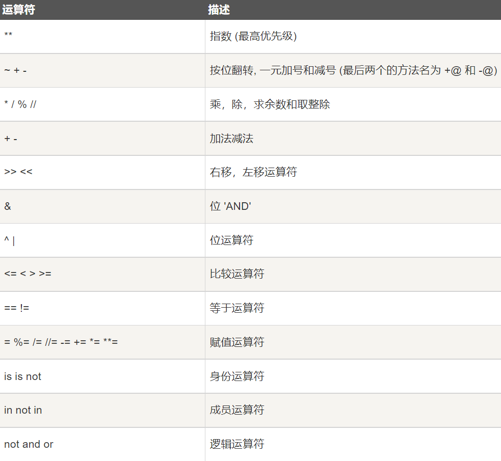

# 标准数据类型

- 数字
- 字符串
- 列表
- 元组
- 集合
- 字典

不可变数据(**3个**): 数字, 字符串, 元组

可变数据(**3个**): 列表, 字典, 集合

## 数字

1. 数字类型转换
   - **int(x)** 将x转换为一个整数
   - **float(x)** 将x转换为一个浮点数
   - **complex(x)** 将x转换为一个复数, 实数部分为 x, 虚数部分为 0
   - **complex(x, y)** 将x和y转换为一个复数
2. 数字运算
   - `+`
   - `-`
   - `*`
   - `/` **这是普通的除法, 返回的是一个浮点数**
   - `//` **这是整除(向下取整)**
3. 数学函数
   - abs(x) 返回数字的绝对值, 如abs(-10) 返回10
   - ceil(x) 返回数字的上入整数, 如math.ceil(4.1) 返回5
   - exp(x) 返回$e^x$ 
   - fabs(x) 返回数字的绝对值的浮点数形式
   - floor(x) 返回数字的下舍整数, 如floor(4.9) 返回 4
   - log(x, y) 返回$log_y x$
   - log10(x) 返回$log_10 x$
   - max(x1, x2,…) 返回给定参数的最大值, 参数可为序列
   - min() 与上面类似
   - modf(x) 返回x的整数部分和小数部分, 两部分的数值符号和x相同,整数部分以浮点型表示
   - pow(x, y) 返回$x^y$
   - round(x[, n]) 返回x的四舍五入值, 如给出n值,则代表舍入到小数点后的位数
   - sqrt(x) 返回$\sqrt x$
4. 随机数函数
   - choice(seq) 从序列的元素中随机挑选一个元素
   - randrange([start,] stop [,step]) 从指定范围内, 按指定基数递增的集合中获取一个随机数, 基数默认值为1
   - random() 随机生成一个实数, 范围在[0, 1)内
   - seed(x) 改变随机数生成器的种子seed
   - shuffle(lst) 将序列的所有元素随机排序
   - uniform(x, y) 随机生成一个实数, 范围在[x, y]内
5. 三角函数
   - degrees(x) 将弧度转换为角度
   - radians(x) 将角度转换为弧度

## 字符串

### 索引


切片为左闭右开的区间(切片时,可以有三个参数:[**开始处索引值**,] **结束处索引值** [, **步长**]; 将步长设为负数, 开始处与结束处索引值选合适值可实现**反向迭代**的效果)

### 转义字符

| 字符         | 含义                                              |
| ------------ | ------------------------------------------------- |
| \\(在行尾时) | 续行符                                            |
| \\\\         | 反斜杠                                            |
| \\'          | 单引号                                            |
| \a           | 响铃                                              |
| \b           | 退格(Backspace)                                   |
| \e           | 转义                                              |
| \000         | 空                                                |
| \n           | 换行                                              |
| \v           | 纵向制表符                                        |
| \t           | 横向制表符                                        |
| \r           | 回车                                              |
| \f           | 换页                                              |
| \oyy         | 八进制数, y代表0~7的字符, 如:\o12代表换行         |
| \xyy         | 十六进制数, 以\x开头, yy代表字符, 如:\x0a代表换行 |
| \other       | 其他的字符以普通格式输出                          |

### 运算符

| 操作符 | 描述                                                         |
| ------ | ------------------------------------------------------------ |
| +      | 字符串连接                                                   |
| *      | 重复输出字符串                                               |
| []     | 通过索引获取字符串中的字符                                   |
| [:]    | 截取字符串中的一部分(如果步长为负, 则`start`和`stop`的索引值依然为原序列的索引值, 而不是将序列反转后的索引值) |
| in     | 成员运算符 -如果字符串中包含给定的字符返回`True`             |
| not in | 成员运算符 -如果字符串中不包含给定的字符返回`True`           |
| r/R    | 原始字符串 -所有的字符串都是直接按照字面的意思来使用, 没有转义特殊或不能打印的字符, 需在字符串的第一个引号前加上`R\r` |
| %      | 格式字符串                                                   |

### 字符串的格式化

- 与`C语言`类似, 例如:

  ```python
  print("My name is %s and weight is %d kg!" % ('Zara', 21))
  ```

- f-string

- str.format()

### 字符串内建函数

| 方法                                                         | 描述                                                         |
| ------------------------------------------------------------ | ------------------------------------------------------------ |
| string.capitalize()/title()                                  | 把字符的第一个字符大写/标题化[^1]                            |
| string.center(width)                                         | 返回一个原字符串居中, 并使用空格填充至长度`width`的新字符串(填充符可以换) |
| string.count(str, beg=0, end=len(string))                    | 返回`str`在`string`里面出现的次数, 如果`beg`或`end`指定则返回指定范围内`str`出现的次数 |
| string.decode(encoding=‘utf-8’, errors=‘strict’)/string.encode() | 以`encoding`指定的编码格式**解码**/**编码**`string`, 如果出错则默认报一个`ValueError`的异常, 除非`errors`指定的是`ignore`或`replace` |
| string.endswith(obj, beg=0, end=len(string))/startswith()    | 检查字符串是否以`obj`**结束**/**开始**, 如果`beg`或`end`指定则检查指定范围内是否以`obj`结束,如果是, 返回`True`, 反之返回`False` |
| string.find(str, beg=0, end=len(string))**[lfind, rfind]**   | 检测`str`是否包含在`string`中(`beg`和`end`等效); 如果在, 返回**开始的索引值**, 不在返回-1 |
| string.format()                                              | 格式化字符串                                                 |
| string.index(str, beg=0, end=len(string))**[lindex, rindex]** | 和`find()`一样, 只不过查找不到时返回一个**异常**             |
| string.isalnum()/isalpha()/<br />isdecimal()/isdigit()/islower()/<br />isnumeric()/isspace()/isupper()/<br />istitle() | 检测是否符合预设格式(字母或数字/字母/十进制数字/数字/小写/数字字符/空格/大写/标题) |
| string.join(seq)                                             | 以`string`作为分隔符, 将`seq`中的所有元素合并为一个新的字符串 |
| string.ljust(width)/rjust(width)**[zfill(width)]**           | 返回一个原字符串左对齐/右对齐, 并使用空格填充至长度`width`的新字符串(填充符可以换)/**zfill**的填充符**不可以换** |
| string.lower()/upper()/swapcase()                            | 返回一个原字符全部小写/大写/翻转大小写的新字符               |
| string.partition(str)**[rpartition]**                        | 从`str`出现的第一个位置起, 把字符串`string`分成一个三元素的元组(string_pre_str, str, string_post_str), 如果`string`里不包含`str`, 则`string_pre_str == string` |
| string.replace(str1, str2, num=string.count(str1))           | 把`string`中的`str1`替换成`str2`, 如果`num`指定, 则替换不超过`num`次 |
| string.split(str=“”, num=string.count(str))                  | 以`str`为分隔符切片`string`, 如果`num`有指定值, 则仅分隔`num+1`个子字符串 |
| string.lstrip([obj])/rstrip()/strip()                        | 截掉`string`**左边**/**右边**/**两边**的`obj`                |
| string.maketrans(intab, outtab)/str.translate(str, del=“”)   | `maketrans()`用于创建字符映射的转换表, `intab`是**需要转换的字符**, `outtab`是**转换后的字符**(其参数可以是一个字典, 但每个字符应该一一对应); `translate()`方法使用转换表进行转换 |

## 列表与元组

### 操作符

| 表达式                      | 结果               | 描述         |
| --------------------------- | ------------------ | ------------ |
| len([1, 2, 3])              | 3                  | 长度         |
| [1, 2, 3] + [4, 5, 6]       | [1, 2, 3, 4, 5, 6] | 组合         |
| [“hi”] * 4                  | [“hi”, “hi”, …]    | 重复         |
| 3 in [1, 2, 3]              | True               | 检测是否存在 |
| for x in [1, 2, 3]: print x | 1 2 3              | 迭代         |

### 截取与访问

与`字符串`相似

### 函数&方法

| 方法                                         | 描述                                                         |
| -------------------------------------------- | ------------------------------------------------------------ |
| cmp(list1, list2)                            | 比较两个列表的元素                                           |
| max(list)/min(list)                          | 返回元素的最大值/最小值                                      |
| list(seq)                                    | 将元组转换为列表                                             |
| tuple(seq)                                   | 将列表转换为元组                                             |
| list.append(obj)                             | 在末尾**添加**新的对象                                       |
| list.count(obj)                              | 统计出现的次数                                               |
| list.extend(seq)                             | 一次性追加多个值                                             |
| list.index(obj)                              | 找出某个值第一个匹配项的索引位置                             |
| list.insert(index, obj)                      | 将对象**插入**列表                                           |
| list.pop([index=-1])                         | 移除列表中的一个元素(默认为最后一个), 并返回这个值           |
| list.remove(obj)                             | 移除列表中的某个值的第一个匹配项                             |
| list.reverse()                               | 反向列表中的元素                                             |
| list.sort(cmp=None, key=None, reverse=False) | 对列表进行排序<br />- cmp—排序的算法<br />- key–指定参与排序的对象<br />- reverse—排序规则, `True`降序, `False`升序 |

元组中的元素不可以进行变更, 所以无法向列表一个进行以上表格下半部分的操作

**注**： 列表和元组的迭代可以通过`enumerate`函数来实现索引-值对的迭代

## 字典与集合

### 函数&方法

| 方法                               | 描述                                                         |
| ---------------------------------- | ------------------------------------------------------------ |
| cmp(dict1, dict2)                  | 比较                                                         |
| len(dict)                          | 长度                                                         |
| str(dict)                          | 输出字典可打印的字符串表示                                   |
| type(variable)                     | 返回输入的变量类型, 如果变量是字典就返回字典类型             |
| pop(key[, default])                | 删除字典给定键`key`所对应的值, 返回值为被删除的值; `key`值必须给出, 否则返回`default` |
| popitem()                          | 返回并删除字典中的最后一对键/值                              |
| dict.clear()                       | 删除字典内的所有元素                                         |
| dict.copy()                        | 返回一个字典的浅复制(深复制父对象[一级目录], 浅复制子对象[二级目录]) |
| dict.fromkeys(seq[, val])          | 创建一个新词典, 以序列`seq`中的元素做字典的键, `val`做字典的值 |
| dict.get(key, default=None)        | 返回指定键的值, 如果值不在字典中返回`default`值              |
| dict.has_key(key)                  | 如果键在字典里返回`True`, 反之返回`False`                    |
| dict.items()                       | 以列表返回可遍历的(键, 值)元组数组**[可遍历]**               |
| dict.keys()                        | 以列表返回一个字典所有的键                                   |
| dict.values()                      | 以列表返回字典中所有的值                                     |
| dict.setdefault(key, default=None) | 与`get()`类似, 如果不在, 将会添加键并将值设为`default`       |
| dict.update(dict2)                 | 把字典`dict2`的键/值对更新到`dict`中                         |
| set.add(key)                       | 添加键                                                       |
| set.remove(key)                    | 移除键                                                       |

### 创建集合和字典的差异

- 创建一个空字典`dict = {}`
- 创建一个空集合`set = set()`

# Python数据类型转换

| 函数                 | 作用                                                         |
| -------------------- | ------------------------------------------------------------ |
| int(x[,base])        | 将`x`转换为一个整数                                          |
| long(x[,base])       | 将`x`转换为一个长整数                                        |
| float(x)             | 将`x`转换为一个浮点数                                        |
| complex(real[,imag]) | 创建一个复数                                                 |
| str(x)               | 将`x`转换为字符串                                            |
| repr(x)              | 将`x`转换为表达式字符串(**将对象转化为供解释器读取的形式**)[^2] |
| eval(str)            | 用来计算在字符串中的有效`Python`表达式, 并返回一个对象       |
| tuple(s)             | 将序列`s`转换为一个元组                                      |
| list(s)              | 将序列`s`转换为一个列表                                      |
| set(s)               | 转换为可变集合                                               |
| dict(d)              | 创建一个字典; `d`必须是一个序列(key, value)元组              |
| frozenset(s)         | 转换为不可变集合                                             |
| chr(x)               | 将一个整数转换为一个字符(`ASCII`字符)                        |
| unichr(x)            | 将一个整数转换为`Unicode`字符                                |
| ord(x)               | 将一个字符转换为它的整数值                                   |
| hex(x)               | 将一个整数转换为一个十六进制字符串                           |
| oct(x)               | 将一个整数转换为一个八进制字符串                             |

# 运算符小结

1. [算术运算符](#运算符)

2. 比较运算符 (`==` 等于, `>=` 大于等于, `<=` 小于等于, `!=` 不等于, `>`/`<` 大于/小于)

3. 赋值运算符 (`=` 赋值, `+=` / `-=` / `*=` / `/=` / `//=` / `%=` / `**=` 相应运算后赋值给原变量, `:=` **海象运算符, 可在表达式内部给变量赋值**[*`Python3.8`新增*])

   ```python
   # 海象运算符示例(可以避免一些运算算两次)
   if (n := len(a)) > 10:
       pass
   ```

4. 位运算符 (`&` 按位与, `|` 按位或, `~` 按位取反, `^` 按位异或, `>>`/`<<` 右移动运算符/左移动运算符)

5. 逻辑运算符 (`and` 与, `or` 或, `not` 非)

6. 成员运算符 (`in` 在, `not in` 不在)

7. 身份运算符 (`is` 是[指`id()`后的标识符相同], `is not` 否)

## 运算符优先级



# 数据结构扩展

## 堆栈

将列表当作堆栈来使用(类似用`C`实现的**链栈**)

```python
# 例
stack = [3, 4, 5]
stack.append(6)		# 压入
stack	# [3, 4, 5, 6]
stack.pop()	# 6		弹出
stack	# [3, 4, 5]
```

## 队列

将列表当作队列使用(同样类似**队列的链表实现**)

```python
# 例
>>> from collections import deque
>>> queue = deque(["Eric", "John", "Michael"])
>>> queue.append("Terry")		# 入队
>>> queue.popleft()				# 出队
'Eric'
>>> queue
deque(['John', 'Michael', 'Terry'])
```

## 遍历技巧

1. 在进行字典遍历时, 可以使用`items()`方法将**关键字**和**值**同时得到

2. 在序列中遍历时, 可以使用`enumerate()`函数将**索引值**和**对应值**同时得到

3. 在遍历两个或更多的序列时, 可以使用`zip()`将其组合

   ```python
   questions = ['name', 'quest', 'favorite color']
   answers = ['lancelot', 'the holy grail', 'blue']
   for q, a in zip(questions, answers):
       print('What is your {0}? It is {1}'.format(q,a))
   
   # What is your name? It is lancelot
   # What is your quest? It is the holy grail
   # What is your favorite color? It is blue
   ```

4. 反向遍历一个序列, 可以使用`reversed()`函数(也可以巧用切片, **用空间换时间**)

5. 顺序遍历一个序列, 可以使用`sorted()`函数返回一个已经排序的序列


[^1]: 所有单词都是以大写开始, 其余字母均为小写
[^2]: 如:`a = 'abc' \\ repr(a)` => `“'abc'”`
