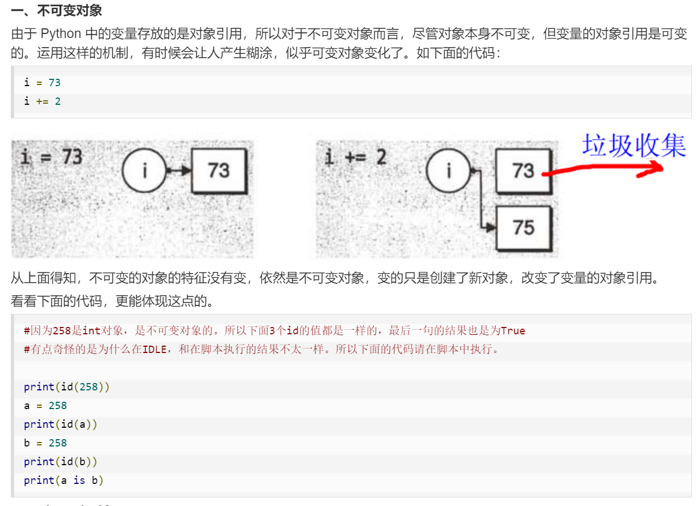
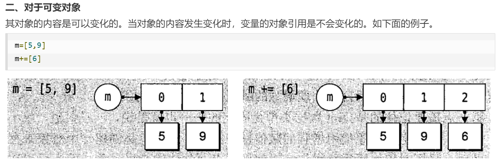

# 定义

- 以`def`关键词开头, 后街函数标识符名称和圆括号`()`
- 任何传入参数和自变量必须放在圆括号中间
- 函数的第一行语句可以选择性的使用文档字符串—用于存放函数说明
- 函数内容以冒号起始并且缩进
- `return [表达式]`结束函数, 选择性的返回一个只给调用方; 不带表达式的`return`相当于返回`None`

# 参数传递

在`Python`中, 类型属于**对象**, 变量是没有类型的, 如`a = [1, 2, 3]`
以上代码中, `[1, 2, 3]`是`list`类型, 而`a`是没有类型的,他仅仅是一个对象的引用(**指针**)

## 可更改与不可更改对象

- 不可变类型: string, tuple和number是不可更改对象
- 可变类型: list, dict等是可更改对象

传递参数过程:

- 不可变类型: 类似**值传递**
- 可变类型: 类似**引用传递**

**补充**: 不可变对象是指对象本身不可变, 但变量的对象引用可变
而可变对象是指对象内容可变, 但变量的对象引用不会改变

# 参数类型

- 必备参数(位置参数)

  必备参数必须以正确的顺序传入函数, 调用时的数量必须和声明时一样

  ```python
  def func(param):
      pass
  ```

  

- 默认参数

  调用函数时, 默认参数的值如果没有传入, 则被认为是默认值

  ```python
  def func(param1, param2=value):
      pass
  ```

- 可变参数(不定长参数)

  可能一个函数能处理比当初声明时更多的参数

  ```python
  def func(*param):
      pass
  ```

  参数会以一个**元组**的形式被传入函数, 如果在调用函数时已有一个**元组**或**列表**, 则如此 `func(*tuple\*list)` 调用

- 关键字参数

  关键字参数允许传入0或任意个含参数名的参数, 这些关键字参数在函数内部自动组装为一个`dict`

  ```python
  def person(name, age, **kw):
      print("name:", name, "age:", age, "other:", kw)
  ```

  如同可变参数, 也可以通过 `person(name, age, **dict)` 将一个已有的字典传入函数

- 命名关键字参数

  命名关键字参数可以限制关键字参数的关键字

  ```python
  def person(name, age, *, city, job):
      print(name, age, city, job)
  ```

  同时命名关键字参数还可以设定默认值`def person(name, *, city="Beijing", job)`

# 匿名函数

`Python`使用`lambda`来创建匿名函数

- `lambda`只是一个表达式, 函数体比`def`简单很多
- `lambda`的主体是一个表达式, 而不是一个代码块
- `lambda`函数拥有自己的命名空间, 且不能访问自由参数列表之外或全局命名空间里的参数
- 虽然`lambda`看起来只能写一行, 却不等同于`C`或`C++`的内联函数

**语法**: `lambda [arg1[, arg2, ...argn]]: expression`

# 变量作用域

- 全局变量

  定义在函数外的拥有全局作用域, 全局变量可以在整个程序范围内访问

- 局部变量

  定义在函数内的拥有局部作用域, 局部变量只能在其被声明的函数内部访问

调用函数时, 所有在函数内声明的变量名称将被加入到作用域中

**注**: 

- 全局变量想作用在函数内, 需加`global`声明
- 外部域变量想作用在内部域, 需加`nonlocal`声明(外部域和内部域是相对概念, 因此在局部域中使用全局变量既可以用`global`也可以用`nonlocal`声明)
- 函数的方法名也可以作为另一个函数的参数

## 命名空间

1. 内置名称空间 (`Python`语言内置的名称空间, 如内置函数名, 异常名)
2. 全局名称 (模块[一个`.py`文件]中定义的名称, 包括函数名, 类名, 导入的模块名, 以及模块级的变量和常量)
3. 局部名称 (函数或类中定义的名称, 包括参数和内部定义的变量名)

## 作用域

1. **L(Local)** 当前域 一个函数/方法内部
2. ***E(Enclosing)*** *外部域* *一般在类中或嵌套函数中, 如`A`中包含了`B`这个函数, 则在`A`下定义的变量对于`B`来说就是外部域的变量*
3. **G(Global)** 全局域 当前文件的全局变量
4. **B(Built-in)** 内置域 包含了内建的变量/关键字等

# 高阶函数

> 函数名也是变量, 或者说函数名是指向具体函数对象的指针变量(**从C的角度理解, 不太一样; C中有类型的是一个个具体的变量, 而Python中有类型的是抽象的对象, 变量只是一个名称, 无类型**), 因此, 我们可以创建一个变量直接用函数名赋值, 此时该变量也指向该函数名指向的函数, 相当于给函数起别名

## 定义

一个函数接收另一个函数作为参数, 这种函数就被称为高阶函数

## 高阶函数举例

### `map`/`reduce`

**语法**: map(function, Iterable, ...)

**参数**: function -- 函数; iterable -- 一个或多个序列

**返回值**: `Python2.x`返回列表, `Python3.x`返回迭代器(**所要处理的数据可能过大, 所以python3改为返回一个迭代器**)

**功能**: 将传入的函数作用于序列的每一个元素, 并以`Iteraor`返回

**例**:

```python
>>> def f(x)
... 	return x*x
...
>>> r = map(f, [1, 2, 3])
>>> list(r)
[1, 4, 9]
```


> `reduce`函数已迁移至`functools`模块, 如要使用, 需先导入

**语法**: reduce(function, itearable[, initializer])

**参数**: `function` -- 函数, 有两个参数; `iterable` -- 可迭代对象; `initalizer` -- 可选, 初始参数

**返回值**: 返回函数计算结果

**功能**: 将函数作用于序列上, 且将上一个返回值于序列的下一个元素做累积计算, 即`reduce(f, [x1, x2, x3]) = f(f(x1, x2), x3)`

**例**:

```python
# 一个将`str`转换为`int`的函数
from functools import reduce

DIGITS = {'0': 0, '1': 1, '2': 2, '3': 3, '4': 4, '5': 5, '6': 6, '7': 7, '8': 8, '9': 9}

def str2int(s):
    def fn(x, y):
        return x * 10 + y
    def char2num(s):
        return DIGITS[s]
    return reduce(fn, map(char2num, s))

# 或者可以用`lambda`函数进一步简化
def str2int(s):
    return reduce(lambda x, y: x * 10 + y, map(lambda w: DIGITS[w], ))
```

**综合运用**:

```python
# 一个将str转换为num的程序
from functools import reduce


def str2num(s):
    DIGITS = {'0': 0, '1': 1, '2': 2, '3': 3, '4': 4, '5': 5, '6': 6, '7': 7, '8': 8, '9': 9}
    if '.' in s:
        s1, s2 = s.split('.', 1)
        if not s1.isdecimal() or not s2.isdecimal():
            return None
        i = reduce(lambda x, y: x * 10 + y, map(lambda x: DIGITS[x], s1))
        j = reduce(lambda x, y: x / 10 + y, map(lambda x: DIGITS[x], s2[-1::-1]))
        return i + j / 10
    if not s.isdecimal():
        return None
    return reduce(lambda x, y: x * 10 + y, map(lambda x: DIGITS[x], s))
```

### filter

**语法**: filter(function, iterable)

**参数**: `function` -- 判断函数, `iterable` -- 可迭代对象

**返回值**: `Python2`返回列表, `Python3`返回迭代器

**功能**: 将传入的函数依次作用于每个元素, 然后根据返回值决定保留还是丢弃该元素

**例**:

```python
# 用filter求素数
def _odd_iter():
    ''' 构造一个从3开始的奇数序列(生成器) '''
    n = 1
    while True:
        n += 2
        yield n
        
def _not_divisible(n):
    return lambda x: x % n > 0

def primes():
    yield 2
    it = _odd_iter()
    while True:
        n = next(it)
        yield n
        it = filter(_not_divisible(n), it)
```

### sorted

**语法**: sorted(iterable, cmp=None, key=None, reverse=False)

**参数**: `iterable` -- 可迭代对象; `cmp`--比较的函数, 这个具有两个参数, 参数的值都是从可迭代对象中取出的, 此函数必须遵守的规则为, 大于则返回1, 小于则返回-1, 等于则返回0; `key`-- 主要是用来进行比较的元素, 只有一个参数, 具体的函数的参数就是取自于可迭代对象中, 指定可迭代对象中的一个元素来进行排序; `reverse`--排序规则, `True`为降序, `False`为升序(**默认**)

**返回值**: 返回重新排序的列表

# 装饰器

## 返回函数

高阶函数除了可以接受函数作为参数外, 还可以把函数作为返回值返回

如: 实现一个可变参数的求和

```python
def calc_sum(*args):
    ax = 0
    for n in args:
        ax = ax + n
    return ax
```

一般可以按以上的方式实现, 但如果此时不需要立刻求和, 而是在后面的代码中, 根据需要再计算， 则可以返回求和的函数：

```python
def lazy_sum(*args):
    def sum():
        ax = 0
        for n in args:
            ax += n
        return ax
    return sum
```

## 闭包

在上述程序中， `lazy_sum`中定义了函数`sum`, 并且`宿命`可以引用外部函数的参数和局部变量, 当`lazy_sum`返回函数`sum`时, 相关的参数和变量豆包存在返回的函数中, 这种称为**闭包**

**注**: 使用闭包时牢记 ***返回函数不要引用任何循环变量, 或者后续会发生变化的变量***
	如果必须使用, 则在创建一个函数, 用该函数的参数绑定循环变量当前的值

## 装饰器

如果我们想在代码运行期间动态增加功能, 而不修改函数的定义, 这种方式称为**装饰器**(例如日志功能, 在程序运行时记录运行的数据)

**语法**: 在一个函数定义的上一行 `@decorator`(相当于执行, `func = decorator(func)`)

**功能**: 相当于在函数运行时附带另一个函数功能, 从程序语句来看, 就是将指向原函数对象的变量指向经装饰器装饰后的函数对象

**注**: 如果想要让**装饰器**也可以接受参数, 则在原装饰器函数的外部再写一层函数, 使得返回的是带参数的装饰器对象(或者不使用`@`语法, 使用装饰器原理的语句)

