# 模块详解

## 1. 定义

模块是一个包含所有你定义的**函数**和**变量**的文件, 其后缀名为`.py`
模块可以被其他的程序引入, 以使用该模块中的函数等功能; 这也是使用`Python`标准库的方法

## 2. 用法

---

### 2.1 `import`语句

1. **语法**: `import module1[, module2[,... moduleN]]`
2. **作用**: 解释器会在搜索路径下寻找导入的模块, 找到则导入, 找不到则报错(一个模块只会被导入一次, 不论使用了几次`import`)
3. **搜索路径**: 在`Python`编译或安装时确定的, 被保存在`sys`模块中的`path`变量中; `sys.path`输出的是一个列表, 其中第一项是空字符串, 代表当前目录(运行脚本时, 脚本所在目录)

### 2.2 `from...import`语句

1. **语法**: `from modname import name1[, name2[,... nameN]]`
2. **作用**: 从模块中导入一个指定的部分到当前命名空间中

### 2.3`from...import *`语句

1. **语法**: `from modname import *`
2. **作用**: 把一个模块的所有内容全部导入到当前的命名空间中(`PEP8`不推荐这种方式)

## 3. 深入模块

---

模块除了方法定义, 还可以包括可执行的代码, 这些代码一般用来初始化这个模块, 这些代码只有在第一次被导入时才会被执行
每个模块都有各自独立的符号表, 在模块内部为所有的函数当作全局符号表来使用

### 3.1 `__name__`属性

一个模块被另一个程序第一次引入时, 其主程序运行; 如果我们想在模块被引入时, 模块中的某一程序块不执行, 可以使用`__name__`属性来使该程序块仅在该模块自身运行时执行
***注***: 每个模块都有一个`__name__`属性, 当值为`‘__main__’`时, 表明该模块自身在运行,  否则是被引入

### 3.2 `dir()`函数

内置的函数`dir()`可以找到模块内定义的所有名称, 以一个字符串列表的形式返回; 如果没有给出参数, 则会罗列出当前定义的所有名称

## 4. 包

---

### 4.1 定义

包是一种管理`Python`模块命名空间的形式, 采用*“点模块名称”*(如: 一个模块的名称为`A.B`, 那么表示一个包`A`中的子模块`B`

### 4.2 导入

1. 在导入一个包时, `Python`会根据`sys.path`中的目录来寻找这个包中包含的子目录
   目录中只有包含一个叫做`__init__.py`(这个文件可以是空文件, 也可以包含一些初始化代码或者为`__all__`变量赋值)

2. 可以通过`import package\package.module`的形式导入一个包或包下的一个子模块, 也可以通过`from package import item`的方式导入一个模块(函数, 变量, 类)
3. 从一个包中导入`*`; 如果包定义文件`__init__.py`存在一个叫做`__all__`的列表变量, 那么在使用`from package import *`的时候就把这个列表中的所有名字作为包内容导入, 如果`__all__`没有定义, 那么将不会导入任何子模块, 而是将当前模块的所有内容导入

## 5. pickle模块

---

1. **功能**: 实现了基本的数据序列化和反序列化
2. **基本接口**: 
   - `pickle.dump(obj, file[, protocol])`(将对象序列化后保存在文件中); 
   - `pickle.load(file)`(将文件中保存的`pickle`对象反序列化后重构为对象)

## 6. OS模块

---

1. **功能**: `os`模块提供了非常丰富的方法用来处理文件和目录
2. **方法**:

| 方法                      | 参数                                                         | 描述                                                         |
| ------------------------- | ------------------------------------------------------------ | ------------------------------------------------------------ |
| os.access()               | <path\> -- 需要检测的路径<br /><mode\> -- 测试模式, 可选值如下<br />**F_OK**: 测试是否存在<br />**R_OK**: 测试是否可读<br />**W_OK**: 测试是否可写<br />**X_OK**: 测试是否可执行 | 使用当前`uid`/`gid`尝试访问路径, 检测是否可进行操作          |
| os.chdir()                | \<path\> -- 路径                                             | 改变当前工作目录                                             |
| os.chmod()                | <path\> -- 路径<br /><mode\> -- 权限模式                     | 更改权限                                                     |
| os.chown()                | <path\> -- 路径<br /><uid\> -- 所属用户ID(不修改设`-1`)<br /><gid\> -- 所属用户组ID(同上) | 更改文件所有者                                               |
| os.chroot()               | <path\> -- 路径                                              | 改变当前进程的根目录                                         |
| os.close()                | <fd\> -- 文件标识符                                          | 关闭文件                                                     |
| os.dup()/os.dup2()        | <fd\> -- 文件标识符<br />dup2还需要接受fd2                   | dup 复制文件描述符fd, 返回复制后的描述符<br />dup2 将复制后的描述符变量作为参数输入(fd2) |
| os.fchdir()               | <fd\> -- 文件标识符                                          | 通过文件描述符改变当前工作目录                               |
| os.fchmod()               | <fd\> -- 文件标识符<br /><mode\> -- 文件访问权限             | 改变文件的访问权限                                           |
| os.fdopen()               | <fd\> -- 文件标识符<br />[mode] -- 访问模式<br />[bufsize] -- 缓冲空间大小 | 通过文件标识符创建一个文件对象, 并返回这个文件对象           |
| os.fstat()                | fstat() - <fd\> -- 文件标识符<br />lstat() - <path\> -- 文件的路径 | 返回文件标识符`fd`的状态                                     |
| os.fsync()/os.fdatasync() | <fd\> -- 文件标识符                                          | 强制将文件写入磁盘, 但`fdatasync`不强制更新文件状态信息      |
| os.getcwd()               | -                                                            | 返回当前工作目录的`Unicode`对象                              |
| os.link()                 | <src\> -- 硬链接源文件路径<br /><dst\> -- 硬链接目标文件路径 | 创建硬链接                                                   |
| os.listdir()              | <path\> -- 文件路径                                          | 返回`paht`指定的文件路径下包含的文件或文件夹的名字的列表     |
| os.mkdir()                | <path\> -- 文件路径<br />[mode] -- 权限模式(默认为八进制)    | 创建一个文件夹                                               |
| os.makedirs()             | <path\> -- 文件路径<br />[mode] -- 权限模式                  | 递归创建目录                                                 |

## 7. datatime模块

---

**功能**: `datatime`是Python处理日期和时间的标准库

**接口**:

| 方法                              | 参数                                                         | 描述                                                         |
| --------------------------------- | ------------------------------------------------------------ | ------------------------------------------------------------ |
| datetime.datetime()               | <year\> - 年<br /><month\> - 月<br /><date\> - 日<br />[hour\] - 小时<br />[mintue\] - 分钟<br />[second\] - 秒 | 获取一个`datatime`对象                                       |
| datatime.datetime.now()           | -                                                            | 获取当前日期和时间(**返回值类型是`datatime`**)               |
| datetime.datetime.timestamp()     | <datetime\> - 该类型的时间                                   | 将一个`datetime`类型转换为timestamp[^1]                      |
| datetime.datetime.fromtimestamp() | <timestamp\> - 时间戳                                        | 将timestamp转换为`datetime`(datetime 有时区概念, 该转换是在timestamp与本地时间做转换) |
| datetime.datetime.strptime()      | <str\> - 要转换的字符串<br /><pattern\> - 转换格式           | 将字符串转换为`datetime`对象(无时区信息)                     |
| datetime.datetime.strftime()      | <pattern\> - 转换的格式                                      | 将一个`datetime`对象转换为字符串                             |

**运算**: 对日期和时间进行加减实际上就是把datetime往后或往前计算, 加减可以直接用`+`和`-`

### 7.1 本地时间转换为UTC时间

本地时间是指系统设定时区的时间，例如北京时间是UTC+8:00时区的时间，而UTC时间指UTC+0:00时区的时间

一个`datetime`类型有一个时区属性`tzinfo`，但是默认为`None`，所以无法区分这个datetime到底是哪个时区，除非强行给datetime设置一个时区：

```python
>>> from datetime import datetime, timedelta, timezone
>>> tz_utc_8 = timezone(timedelta(hours=8)) # 创建时区UTC+8:00
>>> now = datetime.now()
>>> now
datetime.datetime(2015, 5, 18, 17, 2, 10, 871012)
>>> dt = now.replace(tzinfo=tz_utc_8) # 强制设置为UTC+8:00
>>> dt
datetime.datetime(2015, 5, 18, 17, 2, 10, 871012, tzinfo=datetime.timezone(datetime.timedelta(0, 28800)))
```

如果系统时区恰好是UTC+8:00，那么上述代码就是正确的，否则，不能强制设置为UTC+8:00时区

### 7.2 时区转换

先通过`utcnow()`获得当前UTC时间, 再转换为任意时区的时间:

```python
# 拿到UTC时间，并强制设置时区为UTC+0:00:
>>> utc_dt = datetime.utcnow().replace(tzinfo=timezone.utc)
>>> print(utc_dt)
2015-05-18 09:05:12.377316+00:00
# astimezone()将转换时区为北京时间:
>>> bj_dt = utc_dt.astimezone(timezone(timedelta(hours=8)))
>>> print(bj_dt)
2015-05-18 17:05:12.377316+08:00
# astimezone()将转换时区为东京时间:
>>> tokyo_dt = utc_dt.astimezone(timezone(timedelta(hours=9)))
>>> print(tokyo_dt)
2015-05-18 18:05:12.377316+09:00
# astimezone()将bj_dt转换时区为东京时间:
>>> tokyo_dt2 = bj_dt.astimezone(timezone(timedelta(hours=9)))
>>> print(tokyo_dt2)
2015-05-18 18:05:12.377316+09:00
```

时区转换的关键在于, 拿到一个`datetime`时, 要获知其正确的时区, 然后强制设置时区, 作为基准时间; 然后通过`astimezone()`方法转换到任意时区

## 8. collections模块

---

**功能**: 提供了许多有用的集合类

### 8.1 namedtuple

在表示一个点时, 可以通过`tuple`来表示, 但无法与其它 tuple 区分开, 而又不必定一个`class`, 此时便可用`namedtuple`

`namedtuple()`是一个函数, 他用来创建一个自定义的`tuple`对象, 并规定了其元素个数, 还可以通过属性而不是索引来引用tuple中的某个元素, 此时便可以方便的定义一种数据类型, 具备tuple的不变性, 而且可以根据属性来引用

**例**:

```python
>>> from collections import namedtuple
>>> Point = namedtuple('Point', ['x', 'y'])
>>> p = Point(1, 2)
>>> p.x
1
```

### 8.2 deque

`deque`是为了高效实现插入和删除操作的双向列表, 适合用于队列和栈

`deque`除了实现了`list`的`append()`和`pop()`外, 还支持`appendleft()`和`popleft()`, 这样就可以非常高效的往头部添加或删除元素

### 8.3 defaultdict

使用`dict`时 ,如果引用的Key 不存在, 就会抛出`KeyError`, 如果希望 Key 不存在时, 返回一个默认值, 就可以使用`defaultdict`

**注**: 默认值是通过调用函数返回的, 而函数在创建对象时传入

### 8.4 OrderedDict

使用`dict`时, Key 是无序的, 在对`dict`做迭代时, 无法确定 Key 的顺序

如果要保持 Key 的顺序, 可以使用`OrderedDict`

**注**: Key 的排列顺序为**插入的顺序**, 而不是 Key 本身; `OrderedDict`可以实现一个 FIFO (先进先出)的dict, 当容量超出限制时, 先删除最早添加的 Key

### 8.5 ChainMap

`ChainMap`可以把一组`dict`串起来并组成一个逻辑上的`dict`。`ChainMap`本身也是一个dict，但是查找的时候，会按照顺序在内部的dict依次查找

什么时候使用`ChainMap`最合适？举个例子：应用程序往往都需要传入参数，参数可以通过命令行传入，可以通过环境变量传入，还可以有默认参数。我们可以用`ChainMap`实现参数的优先级查找，即先查命令行参数，如果没有传入，再查环境变量，如果没有，就使用默认参数

**例**:

```python
from collections import ChainMap
import os, argparse

# 构造缺省参数:
defaults = {
    'color': 'red',
    'user': 'guest'
}

# 构造命令行参数:
parser = argparse.ArgumentParser()
parser.add_argument('-u', '--user')
parser.add_argument('-c', '--color')
namespace = parser.parse_args()
command_line_args = { k: v for k, v in vars(namespace).items() if v }

# 组合成ChainMap:
combined = ChainMap(command_line_args, os.environ, defaults)

# 打印参数:
print('color=%s' % combined['color'])
print('user=%s' % combined['user'])
```

### 8.6 Counter

`Counter`是一个简单地计数器, `Counter`实际上也是`dict`的一个子类

**例**:

```python
>>> from collections import Counter
>>> c = Counter()
>>> for ch in 'programming':
...     c[ch] = c[ch] + 1
...
>>> c
Counter({'g': 2, 'm': 2, 'r': 2, 'a': 1, 'i': 1, 'o': 1, 'n': 1, 'p': 1})
>>> c.update('hello') # 也可以一次性update
>>> c
Counter({'r': 2, 'o': 2, 'g': 2, 'm': 2, 'l': 2, 'p': 1, 'a': 1, 'i': 1, 'n': 1, 'h': 1, 'e': 1})
```

## 9. base64模块

---

**功能**: 提供了进行base64编码和解码的模块

**方法**:

| 方法                       | 参数                | 描述                                      |
| -------------------------- | ------------------- | ----------------------------------------- |
| base64.b64encode()         | <str\> - 编码的字节 | 将bytes编码为base64                       |
| base64.b64decode()         | <str\> - 解码的字节 | 将base64解码为bytes                       |
| base64.urlsafe_b64encode() | <str\> - 编码的字节 | 将bytes编码为base64(将`+`/`/`换为`-`/`_`) |

## 10. struct模块

---

**功能**: 解决`bytes`和其它二进制数据类型的转换

**方法**:

| 方法            | 参数                                                         | 描述                        |
| --------------- | ------------------------------------------------------------ | --------------------------- |
| struct.pack()   | <command\> - 处理指令(指定字节顺序和类型)<br />- `>` 大端序 - `<` 小端序 - `I` 4字节无符号整数 - `H` 2字节无符号整数 - `c` 1字节字符<br /><data\> - 需要处理的数据 | 将任意数据类型转换为bytes   |
| struct.unpack() | <command\> - 处理指令(指定字节顺序和类型)<br /><bytes\> - 需要处理的字节串 | 将bytes转换为相应的数据类型 |

## 11. hashlib模块

---

**功能**: 提供了常见的`hash`函数

**方法**:

| 方法                   | 参数                        | 描述                                                     |
| ---------------------- | --------------------------- | -------------------------------------------------------- |
| hashlib.md5()          | [bytes] - 需加密的字节串    | 返回一个运用md5算法的`HASH`对象                          |
| hashlib.sha1()         | [bytes] - 需加密的字节串    | 返回一个sha1算法的`hash`对象                             |
| hashObject.update()    | <bytes\> - 需要加密的字节串 | 更新`hashObject`加密的字节串(将更新的数据接在原字符串后) |
| hashObject.hexdigest() | -                           | 返回加密后的十六进制字符串                               |

为确保简单口令不被**反推**(先生成一些简单口令的md5值, 然后构建 md5 -> 口令 的反推表)出来, 可以对一个原始口令加一个复杂字符来实现, 俗称“**加盐**”; 通常添加的用户名, 这样也可以尽量避免在同一个数据库中, 两个用户口令的md5值相同(**口令相同**)

## 12. hmac模块

---

如果salt是我们自己随机生成的，通常我们计算MD5时采用`md5(message + salt)`。但实际上，把salt看做一个“口令”，加salt的哈希就是：计算一段message的哈希时，根据不同口令计算出不同的哈希。要验证哈希值，必须同时提供正确的口令

这实际上就是`Hmac`算法, 它通过一个标准算法, 在计算哈希时, 把 Key 混入计算过程中, 相比于自定义的加salt算法, Hmac 悬法对所有hash算法都通用, 而且也更标准化和安全

**功能**: 提供了标准的 Hmac 算法

**方法**: `hmac.new(<key>, <message>, [digestmod])` 返回一个`hmac`对象

- <key\> 密钥(bytes)

- [message] 原始信息(bytes)

- <digestmod\> hash算法

与`hashObject`类似, `hmacObject`也有`update()`和`hexdigest()`方法

## 13. itertools模块

---

**功能**: 提供了很多用于操作迭代对象的函数

**类**:

- `itertools.count()`: 创建一个无限的计数迭代器(**参数**: [basenumber\] 基数, 从该数开始(默认为`0`) [step] 迭代步长)
- `itertools.cycle()`: 创建一个无限的序列循环迭代器(**参数**: <seq\> 迭代序列)
- `itertools.repeat()`: 创建一个无限的元素迭代器(**参数**: <data\> 元素, [num] 迭代次数)
- `itertools.takewhile()`: 创建一个可以根据函数进行条件判断来停止原迭代器的迭代器(**参数**: <func\> 进行判断的函数, <itertor\> 迭代器)

**方法**:

- `itertools.chain()`: 将一组迭代对象串连起来, 形成一个更大的迭代器
  **参数**: <iterable[, iterable[, ...]]\> 一组可迭代对象
  **返回值**: 一个迭代器
- `itertools.groupby()`: 将迭代器中相邻的重复元素挑出来放在一组
  **参数**: <iterable\> 可迭代对象, [func] 条件函数, 该函数返回值相同则在一组中
  **返回值**: 一个元组迭代器 (key, 元素迭代器)

## 14. contextlib模块

---

在Python中, 任何对象只要正确的实现了上下文管理, 就可以用于`with`语句, 而实现上下文管理是通过`__enter__`和`__exit__`两个方法来实现的

**功能**: 提供一些装饰器来帮助我们实现上下文管理功能

**方法**:

- `@contextmanager` 装饰generator来简化上下文管理
  **例**:

  ```python
  from contextlib import contextmanager
  
  class Query(object):
  
      def __init__(self, name):
          self.name = name
  
      def query(self):
          print('Query info about %s...' % self.name)
  
  @contextmanager
  def create_query(name):
      print('Begin')
      q = Query(name)
      yield q
      print('End')
  ```

- `closing()` 将任意对象转换为上下文对象
  **参数**: <object\> 不支持上下文管理的对象
  **返回值**: 一个上下文对象
  **例**:

  ```python
  from contextlib import closing
  from urllib.request import urlopen
  with closing(urlopen('https://www.python.org')) as page:
      for line in page:
          print(line)
  ```

  **实现**:

  ```python
  @contextmanager
  def closing(thing):
      try:
          yield thing
      finally:
          thing.close()
  ```

## 15. urllib包

---

**功能**: 提供了一系列用于操作`url`的功能

**模块**:

- `urllib.request` 打开和读取 url
- `urllib.error` 包含urllib.request 抛出的异常
- `urllib.parse` 解析 url
- `urllib.robotparser` 解析robots.txt文件



### **15.1** urllib.request

该模块定义了一些**打开URL**的函数和类, 包含**授权验证, 重定向, 浏览器 cookies**; 可以模拟浏览器的一个请求发起过程

| 方法(urllib.request模块下)                                   | 参数                                                         | 描述                                           |
| ------------------------------------------------------------ | ------------------------------------------------------------ | ---------------------------------------------- |
| urlopen()                                                    | <url\> 访问的url<br />[data] 发送到服务器的其它数据对象<br />[timeout] 访问超时时间<br />[cafile]/[capath] cafile为CA证书, capath为CA证书路径(**使用HTTPS需要**)<br />[context] `ssl.SSLContext`类型, 用来指定 SSL 设置 | 打开一个URL, 返回一个httpObject                |
| httpObject.read() \|<br />~.readline() \|<br />~.readlines() | [buffer] 读取的长度 \|<br />- \|<br />-                      | 读取网页内容(读取全部, 读取一行, 按行读取全部) |
| httpObject.getcode()<br />**httpObject.status/~.reason**[两个属性分别返回状态码和状态返回值] | -                                                            | 获取网页状态码                                 |
| httpObject.getheaders()                                      | -                                                            | 获取HTTP响应头信息                             |
| quote() \|<br />unquote()                                    | <url\> 需编码的 url \| <br /><str\> - 需解码的 字符串        | url 编码和解码                                 |
| Request()类                                                  | <url\> [data] 同`urlopen`<br />[headers] 请求的头部信息, 字典<br />[origin_req_host] 请求到主机地址, IP或域名<br />[unverifiable] 设置网页是否需要验证, 默认为`False`, 一般不设置<br />[method] 指定请求的方法, 如GET, POST... | 生成一个`Request`对象, 可传入`urlopen`打开     |

### 15.2 urllib.error

**功能**: 为`urllib.request`所引发的异常定义了异常类, 基础异常类是 URLError

**方法**:

- `URLError`: `OSError`的子类, 用于处理程序遇到问题时会引发此异常, 包含的属性 reason 为引发异常的原因
- `HTTPError`: `URLError`的子类, 用于处理特殊HTTP错误;
  例如作为认证请求的时候, 包含的属性`code`为HTTP的状态码, `reason`为引发异常的原因, `headers`为导致 HTTPError 的特定HTTP请求的响应头

### 15.3 urllib.parse

**功能**: 用于解析 url

| 方法                            | 参数                                                         | 描述                                                         |
| ------------------------------- | ------------------------------------------------------------ | ------------------------------------------------------------ |
| urlparse()                      | <url\> ~<br />[scheme] 协议类型<br />[allow_fragments] 默认为True, 如果为False, 则不解析`fragment`部分, 返回值中的该部分为None, 值并入前一有数据的部分 | 返回一个`Parse`对象, 基类为元组(scheme, netloc, path, params, query, fragment) |
| parseObject.geturl()            | -                                                            | 获取该对象的原url                                            |
| parseObject[i]/parseObject.attr | -                                                            | 通过索引或属性名访问元组的值(除了六个属性值外, 还可以通过`port`属性访问端口, `hostname`访问主机名, `username`用户名, `password`密码) |

### 15.4 urllib.robotparser

**功能**: 用于解析 [robots.txt文件](../杂/Robot协议.md)

**类**:

​	**定义**: `class urllib.robotparser.RobotFileParser(url='')`

​	**方法**:

- `set_url(rul)` 设置 robots.txt 文件的URL
- `read()` 读取 robots.txt URL并将其输入解析器
- `parse(lines)` 解析行参数
- `can_fetch(useragent, url)` 如果允许 useragent 按照被解析 robots.txt 文件中的规则来获取 url, 则返回`True`
- `mtime` 返回最近一次获取 robots.txt 文件的时间
- `modified()` 将最近一次获取文件的时间设置为当前时间
- `crawl_delay(useragent)` 为指定的 useragent 从 robots.txt 返回 Crawl-delay 形参;
  如果此形参不存在或不适用于指定的 useragent 或者此形参的 robots.txt 条目存在语法错误，则返回 None
- `request_rate(useragent)` 以``named tuple RequestRate(requests, seconds)``的形式从 robots.txt 返回 Request-rate 形参的内容
   如果此形参不存在或不适用于指定的 useragent 或者此形参的 robots.txt 条目存在语法错误，则返回 None
- `site_maps()`以 list() 的形式从 robots.txt 返回 Sitemap 形参的内容
  如果此形参不存在或者此形参的 robots.txt 条目存在语法错误，则返回 None。

## 16. tqdm模块

**功能**: 提供进度条的模块

**用法**:

- 迭代的形式
  使用`tqdm.tqdm()`来封装可迭代对象(`trange()`是封装了 range() 的 tqdmObject

  ```python
  from tqdm import tqdm, trange
  from time import sleep
  for char in tqdm(['a', 'b', 'c', 'd']):
      print('Process: {}'.format(char))
      sleep(0.25)
  # 使用trange()
  for i in trange(100):
      sleep(0.01)
  # 还可以控制进度条显示当前步骤的名称
  pbar = tqdm(['a', 'b', 'c', 'd'])
  for char in pbar:
      sleep(0.25)
      pbar.set_description("Processing {}".format(char))
  ```

- 手动更新的形式
  使用`tqdm.tqdm(total=MAXNUM)`来创建一个总数为`MAXNUM`的进度条对象, 然后通过`tqdmObject.update(num)`来更新进度条

### 16.1tqdm模块参数说明

```python
class tqdm(object):
  """
  Decorate an iterable object, returning an iterator which acts exactly
  like the original iterable, but prints a dynamically updating
  progressbar every time a value is requested.
  """

  def __init__(self, iterable=None, desc=None, total=None, leave=True,
               file=sys.stderr, ncols=None, mininterval=0.1,
               maxinterval=10.0, miniters=None, ascii=None,
               disable=False, unit='it', unit_scale=False,
               dynamic_ncols=False, smoothing=0.3, nested=False,
               bar_format=None, initial=0, gui=False):
```

- iterable: 可迭代的对象, 在手动更新时不需要进行设置

- desc: 字符串, 左边进度条描述文字

- total: 总的项目数

- leave: bool值, 迭代完成后是否保留进度条

- file: 输出指向位置, 默认是终端, 一般不需要设置

- ncols: 调整进度条宽度, 默认是根据环境自动调节长度, 如果设置为0, 就没有进度条, 只有输出的信息

- mininterval / maxinterval: 进度条最小/大更新间隔

- unit: 描述处理项目的文字, 默认是'it', 例如: 100 it/s, 处理照片的话设置为'img' ,则为 100 img/s

- unit_scale: 自动根据国际标准进行项目处理速度单位的换算, 例如 100000 it/s >> 100k it/s

- bar_format: 自定义进度条

  ```
  bar_format='{l_bar}{bar}{r_bar}'
  
  l_bar: {desc}: {precentage:3.0f}%|
  bar: 进度条
  r_bar: |{n_fmt}/{total_fmt}[{elapsed}<{remaining}, {rate_fmt}{postifx}]
  ```

  - percentage:百分比
  - n_fmt：当前数
  - total_fmt：总数
  - elapsed：消耗的时间
  - remaining：剩余时间
  - rate_fmt：速率
  - postifx：后缀字典描述

  **注**: desc、postfix默认为空

## 17. argparse 模块

**功能**: 命令行选项, 参数和子命令解析器; 可以轻松地编写用户友好的命令行接口

### 17.1 ArgumentParser 对象

```python
class argparse.ArgumentParser(prog=None, usage=None, description=None, epilog=None, parents=[], formatter_class=argparse.HelpFormatter, prefix_chars='-', fromfile_prefix_chars=None, argument_default=None, conflict_handler='error', add_help=True, allow_abbrev=True, exit_on_error=True)
```

创建一个新的 [`ArgumentParser`](https://docs.python.org/zh-cn/3/library/argparse.html#argparse.ArgumentParser) 对象。所有的参数都应当作为关键字参数传入。每个参数在下面都有它更详细的描述，但简而言之，它们是：

- [prog](https://docs.python.org/zh-cn/3/library/argparse.html#prog) - 程序的名称（默认值：`sys.argv[0]`）
- [usage](https://docs.python.org/zh-cn/3/library/argparse.html#usage) - 描述程序用途的字符串（默认值：从添加到解析器的参数生成）
- [description](https://docs.python.org/zh-cn/3/library/argparse.html#description) - 在参数帮助文档之前显示的文本（默认值：无）
- [epilog](https://docs.python.org/zh-cn/3/library/argparse.html#epilog) - 在参数帮助文档之后显示的文本（默认值：无）
- [parents](https://docs.python.org/zh-cn/3/library/argparse.html#parents) - 一个 [`ArgumentParser`](https://docs.python.org/zh-cn/3/library/argparse.html#argparse.ArgumentParser) 对象的列表，它们的参数也应包含在内
  - 从`父 ArgumentParser`对象继承它的选项或参数, 而不需要重新定义
  - **注**: 大部分的父解析器会指定`add_help=False`, 否则在打印==帮助信息==时, 会依次打印父解析器和子解析器的帮助信息, **并产生一个错误**
- [formatter_class](https://docs.python.org/zh-cn/3/library/argparse.html#formatter-class) - 用于自定义帮助文档输出格式的类
- [prefix_chars](https://docs.python.org/zh-cn/3/library/argparse.html#prefix-chars) - 可选参数的前缀字符集合（默认值： '-'）
- [fromfile_prefix_chars](https://docs.python.org/zh-cn/3/library/argparse.html#fromfile-prefix-chars) - 当需要从文件中读取其他参数时，用于标识文件名的前缀字符集合（默认值： `None`）
- [argument_default](https://docs.python.org/zh-cn/3/library/argparse.html#argument-default) - 参数的全局默认值（默认值： `None`）
- [conflict_handler](https://docs.python.org/zh-cn/3/library/argparse.html#conflict-handler) - 解决冲突选项的策略（通常是不必要的）
- [add_help](https://docs.python.org/zh-cn/3/library/argparse.html#add-help) - 为解析器添加一个 `-h/--help` 选项（默认值： `True`）
- [allow_abbrev](https://docs.python.org/zh-cn/3/library/argparse.html#allow-abbrev) - 如果缩写是无歧义的，则允许缩写长选项 （默认值：`True`)
- [exit_on_error](https://docs.python.org/zh-cn/3/library/argparse.html#exit-on-error) - 决定当错误发生时是否让 ArgumentParser 附带错误信息退出。 (默认值: `True`)

1. **add_argument()** 方法

   ```python
   ArgumentParser.add_argument(name or flags...[, action][, nargs][, const][, default][, type][, choices][, required][, help][, metavar][, dest])
   ```

   - [name or flags](https://docs.python.org/zh-cn/3/library/argparse.html#name-or-flags) - 一个命名或者一个选项字符串的列表，例如 `foo` 或 `-f, --foo`

   - [action](https://docs.python.org/zh-cn/3/library/argparse.html#action) - 当参数在命令行中出现时执行指令的基本类型

     - `‘store’` - 存储参数的值, **默认**
     - `‘store_const’` - 存储被`const`参数指定的值
     - `‘sotre_true’` 和 `‘store_false’` - 这是`‘store_const’`存储 True 和 False 的特殊用法
     - `‘append’` - 存储一个列表, 并且将每个参数值追加到列表中; 在允许多次使用选项时很有用
     - `‘append_const’` - 与`‘store_const’`类似
     - `‘count’` - 计算一个关键字参数出现的数目或次数
     - `‘help’` - 打印所有当解析器中的选项和参数的完整帮助信息, 默认情况下将自动加入解析器
     - `‘version’` - 打印版本信息并在调用后退出
     - `‘extend’` - 存储一个列表

   - [nargs](https://docs.python.org/zh-cn/3/library/argparse.html#nargs) - 命令行参数应当消耗的数目

     - `N` (一个整数) 命令行中的 N 个参数会被聚集到一个列表中
     - `‘?’` `‘+’` `‘*’`- 与正则表达式意义类似
     - **注**: 如果不提供`nargs`参数, 则消耗参数的数目将被`action`决定

   - [const](https://docs.python.org/zh-cn/3/library/argparse.html#const) - 被一些 [action](https://docs.python.org/zh-cn/3/library/argparse.html#action) 和 [nargs](https://docs.python.org/zh-cn/3/library/argparse.html#nargs) 选择所需求的常数

   - [default](https://docs.python.org/zh-cn/3/library/argparse.html#default) - 当参数未在命令行中出现并且也不存在于命名空间对象时所产生的值

   - [type](https://docs.python.org/zh-cn/3/library/argparse.html#type) - 命令行参数应当被转换成的类型

   - [choices](https://docs.python.org/zh-cn/3/library/argparse.html#choices) - 可用的参数的容器

   - [required](https://docs.python.org/zh-cn/3/library/argparse.html#required) - 此命令行选项是否可省略 （仅选项可用）

   - [help](https://docs.python.org/zh-cn/3/library/argparse.html#help) - 一个此选项作用的简单描述

   - [metavar](https://docs.python.org/zh-cn/3/library/argparse.html#metavar) - 在使用方法消息中使用的参数值示例 (打印==帮助信息==时, 可以替换当前属性或选项所需数值的提示文字)

     ```python
     >>> parser = argparse.ArgumentParser()
     >>> parser.add_argument('--foo', metavar='YYY')
     >>> parser.add_argument('bar', metavar='XXX')
     >>> parser.parse_args('X --foo Y'.split())
     Namespace(bar='X', foo='Y')
     >>> parser.print_help()
     usage:  [-h] [--foo YYY] XXX
     
     positional arguments:
      XXX
     
     options:
      -h, --help  show this help message and exit
      --foo YYY
     ```

   - [dest](https://docs.python.org/zh-cn/3/library/argparse.html#dest) - 被添加到 [`parse_args()`](https://docs.python.org/zh-cn/3/library/argparse.html#argparse.ArgumentParser.parse_args) 所返回对象上的属性名

2. **parse_args()** 方法

   ```python
   ArgumentParser.parse_args(args=None, namespace=None)
   ```

   将参数字符串转换为对象并将其设为命名空间的属性。 返回带有成员的命名空间

   之前对 [`add_argument()`](https://docs.python.org/zh-cn/3/library/argparse.html#argparse.ArgumentParser.add_argument) 的调用决定了哪些对象被创建以及它们如何被赋值

   - [args](https://docs.python.org/zh-cn/3/library/argparse.html#args) - 要解析的字符串列表。 默认值是从 [`sys.argv`](https://docs.python.org/zh-cn/3/library/sys.html#sys.argv) 获取
   - [namespace](https://docs.python.org/zh-cn/3/library/argparse.html#namespace) - 用于获取属性的对象。 默认值是一个新的空 [`Namespace`](https://docs.python.org/zh-cn/3/library/argparse.html#argparse.Namespace) 对象

3. **Namespace** 对象

   ```python
   class argparse.Namespace
   ```

   由 [`parse_args()`](https://docs.python.org/zh-cn/3/library/argparse.html#argparse.ArgumentParser.parse_args) 默认使用的简单类，可创建一个存放属性的对象并将其返回

   **注**: 使用`parse_args()`解析后的`Namespace`对象可以通过访问其属性来访问获取的值 `Namespace.nameORflag`

## 18. secrets 模块

**功能**: 用于生成高度加密的随机数, 可以用于替换`random`模块的伪随机数生成器; 是操作系统提供的最安全的随机性来源

**方法**:

| 方法             | 参数                   | 描述                                                         |
| ---------------- | ---------------------- | ------------------------------------------------------------ |
| choice()         | seq - 来源序列         | 从非空序列中随机选取一个元素                                 |
| randbelow()      | n - 范围上限           | 从[0, n)中选取一个随机整数                                   |
| randbits()       | k - 位数               | 返回  k 位随机比特位的整数                                   |
| token_bytes()    | [nbytes=None] - 字节数 | 返回含 nbytes 个字节的随机字节串                             |
| token_hex()      | [nbytes=None] - 字节数 | 返回含 nbytes 个字节的随机十六进制字节串(也即返回 2 x nbytes 个文本) |
| token_urlsafe()  | [nbytes=None] - 字节数 | 返回安全的URL随机文本字符串, 含 nbytes 个字节(文本用base64编码, 也即每个字节对应1.3个结果字符) |
| compare_digest() | *a*, *b*               | 比较 *a*, *b* 是否相等, 相等则返回 True                      |

## 19. platform 模块

**功能**: 获取底层平台的标识数据

### 19.1 跨平台

| 方法                                      | 参数                                                         | 描述                                                         |
| ----------------------------------------- | ------------------------------------------------------------ | ------------------------------------------------------------ |
| machine()                                 | -                                                            | 返回机器类型                                                 |
| node()                                    | -                                                            | 返回计算机的网络名称(**可能不是完整限定名称**)               |
| platform()                                | [aliased=0] - 系统别名(真值有效)<br />[terse=0] - 最小量信息(真值有效) | 返回一个标识底层平台的字符串, “人类易读”                     |
| processor()                               | -                                                            | 返回 (真实的) 处理器名称                                     |
| python_build()                            | -                                                            | 返回一个元组(buildno, builddate), 编译代码和日期             |
| python_compiler()                         | -                                                            | 返回一个标识用于编译 Python 的编译器                         |
| python_version() / python_version_tuple() | -                                                            | 以`‘major.minor.patchlevel’`形式返回 Python 版本信息<br />以元组返回 |
| release()                                 | -                                                            | 返回系统的发布版本                                           |
| system()                                  | -                                                            | 返回系统平台的名称                                           |
| version()                                 | -                                                            | 返回系统的发布版本                                           |
| uname()                                   | -                                                            | 返回包含六个属性的 namedtuple(): system, node, release, version, machine, processor |

## 20. XML 模块

**功能**: 解析 XML 文件

### 20.1 DOM 和 SAX

操作XML有两种方法：DOM和SAX。`DOM`会把整个XML读入内存，解析为树，因此占用内存大，解析慢，优点是可以任意遍历树的节点。`SAX`是流模式，边读边解析，占用内存小，解析快，缺点是我们需要自己处理事件

正常情况下，优先考虑SAX，因为DOM实在太占内存

在Python中使用SAX解析XML非常简洁，通常我们关心的事件是`start_element`，`end_element`和`char_data`，准备好这3个函数，然后就可以解析xml了。

举个例子，当SAX解析器读到一个节点时：

```
<a href="/">python</a>
```

会产生3个事件：

1. start_element事件，在读取`<a href="/">`时
2. char_data事件，在读取`python`时
3. end_element事件，在读取`</a>`时

**函数**:

`xml.parsers.expat.ParserCreate(encoding=None, namespace_separator=None)`
创建并返回一个新的 xmlparser 对象

**XMLParser 对象**

| 方法        | 参数            | 描述                  |
| ----------- | --------------- | --------------------- |
| Parse()     | data - 解析数据 | 解析 xml 数据         |
| ParseFile() | file - 解析文件 | 从文件中解析 xml 数据 |

**例**:

```python
from xml.parsers.expat import ParserCreate

class DefaultSaxHandler(object):
    def start_element(self, name, attrs):
        print('sax:start_element: %s, attrs: %s' % (name, str(attrs)))

    def end_element(self, name):
        print('sax:end_element: %s' % name)

    def char_data(self, text):
        print('sax:char_data: %s' % text)

xml = r'''<?xml version="1.0"?>
<ol>
    <li><a href="/python">Python</a></li>
    <li><a href="/ruby">Ruby</a></li>
</ol>
'''

handler = DefaultSaxHandler()
parser = ParserCreate()
parser.StartElementHandler = handler.start_element
parser.EndElementHandler = handler.end_element
parser.CharacterDataHandler = handler.char_data
parser.Parse(xml)
```

**注**: 需要注意的是读取一大段字符串时，`CharacterDataHandler`可能被多次调用，所以需要自己保存起来，在`EndElementHandler`里面再合并

## 21. HTMLParser 模块

**功能**: 解析HTML页面 (本质上 HTML 是 XML 的子集, 但 HTML 的语法没有 XML 那么严格, 所以不能用标准的 DOM 和 SAX 来解析)

**用法**: 创建一个`HTMLParser(*, convert_charrefs=True)`[^ 2]子类的实例, 重写解析方法来实现功能

**方法**:

- `feed(data)` - 填充一些文本到解析器, 如果包含完整的元素, 则被处理; 如果数据不完整, 将被缓冲知道更多数据被填充或 `close()`被调用
- `close()` - 强制处理所有缓冲数据
- `reset()` - 重置实例
- `getpos()` - 返回当前行号和偏移值
- `handle_*` - 这些方法都需重载来处理对应的数据

## 22. logging 模块

**功能**: 为程序提供一个标准化的日志记录器

- 进行程序(代码)的调试
- 程序运行过程中的问题定位和分析
- 收集程序运行的情况

**相关知识**: 

1. 日志等级

   | 等级(从低到高) | 数值 | 描述                                                         |
   | -------------- | ---- | ------------------------------------------------------------ |
   | NOTSET         | 0    | 未设置级别 (创建记录器时默认设置的级别[**除根记录器**])      |
   | DEBUG          | 10   | 调试, 记录最详细的日志信息, 在问题诊断时有用                 |
   | INFO           | 20   | Information 简称, 记录一些设置的关键结点信息                 |
   | WARNING        | 30   | 警告, 记录不期望的事情发生时的信息(如: 磁盘可用空间较低), 程序仍正常 |
   | ERROR          | 40   | 错误, 记录由于更严重的问题而导致软件无法执行某些功能时的信息 |
   | CRITICAL       | 50   | 严重, 记录发生严重错误, 程序本身可能无法继续运行时的信息     |

2. logging.basicConfig()

   通过使用默认的 [`Formatter`](https://docs.python.org/zh-cn/3/library/logging.html#logging.Formatter) 创建一个 [`StreamHandler`](https://docs.python.org/zh-cn/3/library/logging.handlers.html#logging.StreamHandler) 并将其加入根日志记录器来为日志记录系统执行基本配置。 如果没有为根日志记录器定义处理器则 [`debug()`](https://docs.python.org/zh-cn/3/library/logging.html#logging.debug), [`info()`](https://docs.python.org/zh-cn/3/library/logging.html#logging.info), [`warning()`](https://docs.python.org/zh-cn/3/library/logging.html#logging.warning), [`error()`](https://docs.python.org/zh-cn/3/library/logging.html#logging.error) 和 [`critical()`](https://docs.python.org/zh-cn/3/library/logging.html#logging.critical) 等函数将自动调用 [`basicConfig()`](https://docs.python.org/zh-cn/3/library/logging.html#logging.basicConfig)

   如果根日志记录器已配置了处理器则此函数将不执行任何操作，除非关键字参数*force*被设为`True`
   
   | 参数     | 作用                                                         |
   | -------- | ------------------------------------------------------------ |
   | filename | 指定保存日志的文件名                                         |
   | filemode | 如果指明了文件名, 指定打开文件的模式                         |
   | format   | 指定输出的格式和内容                                         |
   | datefmt  | 指定时间格式, 同time.strftime()                              |
   | level    | 指定更日志记录器级别, 默认为 logging.WARNING                 |
   | stream   | 指定日志的输出流, 可以指定输出到 sys.stderr, sys.stdout 或者文件, 默认输出到 sys.stderr, 当 stream 和 filename 同时指定时, stream被忽略 |

   格式参数
   
   | 格式           | 描述               |
   | -------------- | ------------------ |
   | %(levelno)s    | 日志级别           |
   | %(levelname)s  | 日志级别名称       |
   | %(pathname)s   | 当前程序的路径     |
   | %(filename)s   | 当前程序名称       |
   | %(funcName)s   | 日志所属的当前函数 |
   | %(lineno)d     | 日志的当前行号     |
   | %(asctime)s    | 日志的时间         |
   | %(thread)d     | 线程的ID           |
   | %(threadName)s | 线程的名称         |
   | %(process)d    | 进程的ID           |
   | %(message)s    | 日志的信息         |
   | %(name)s       | 记录器的名字       |
   
3. logging 组件

   | 组件名称       | 对应类名  | 描述                                                         |
   | -------------- | --------- | ------------------------------------------------------------ |
   | 日志器(记录器) | Logger    | 提供了应用程序可以一直使用的接口                             |
   | 处理器         | Handler   | 将创建的日志记录发送到合适的目的输出                         |
   | 过滤器         | Filter    | 提供了更细粒度的控制工具来确定输出哪条日志记录, 丢器哪条日志记录 |
   | 格式器         | Formatter | 决定日志记录的最终输出格式                                   |

   这些组件共同完成日志的配置和输出:

   - `Logger` 需要通过 `Handler` 将日志信息输出到目标位置, 目标位置可以是 sys.stdout 和文件等
   - 不同的 `Handler` 可以将日志输出到不同的位置(不同的日志文件)
   - `Logger`可以设置多个`Handler`将同一条日志记录输出到不同的位置
   - 每个`Handler`都可以设置自己的`Filter`来实现日志过滤, 保留书记项目中需要的日志
   - `Formatter`实现同一条日志以不同的格式输出到不同的地方

   **简单地说: 日志器作为入口, 通过设置处理器的方式将日志输出, 处理器在通过过滤器和格式器对日志进行相应的处理操作**

**组件的常用方法**

1. `Logger`类

   **不要实例化`Logger`类, 而使用模块级别的函数`logging.getLogger(name)`来获取日志器**

   | 方法                                                       | 描述                                        |
   | ---------------------------------------------------------- | ------------------------------------------- |
   | Logger.setLevel()                                          | 设置日志消息级别                            |
   | Logger.addHandler() / removeHandler()                      | 添加 / 移除一个`Handler`对象                |
   | Logger.addFilter() / removeFilter()                        | 添加 / 移除一个`Filter`对象                 |
   | logger.debug() / info() / warning() / error() / critical() | 设置对应级别的日志记录                      |
   | Logger.exception()                                         | 输出堆栈追踪信息                            |
   | Logger.log()                                               | 设置一个自定义的level参数来创建一个日志记录 |

2. `Handler`类

   **不要实例化`Handler`类, 而是用这个类来派生其它更有用的子类**

   | 方法                                             | 描述                                                         |
   | ------------------------------------------------ | ------------------------------------------------------------ |
   | Handler.setLevel()                               | 设置日志消息级别                                             |
   | Handler.setFormatter()                           | 设置一个格式器对象                                           |
   | Handler.addFilter() / removeFilter()             | 添加 / 移除一个`Filter`对象                                  |
   | Handler.flush()                                  | 确保所有日志记录从缓存输出                                   |
   | logging.StreamHandler() / logging.FileHandler()  | 将日志消息发送到`Stream`/磁盘文件(**文件大小会无限增长**)    |
   | logging.handlers.HTTPHandler() / ~.SMTPHandler() | 将日志消息通过`GET`或`POST`方式发送给一个HTTP服务器 / 给对应的`email`地址发送邮件 |
   
3. `Filter`类

   简单来说, `Filter`是一个过滤器基类, 它只允许某个`logger`层级下的日志事件通过过滤保存下来

   定义如下:

   ```python
   class logging.Filter(name=''):
       filter(record)
   ```

4. `Formatter`类

   主要负责日志的格式化输出

   通过`logging.Formatter(fmt=None, datefmt=None)`来实例化格式器, 未指定`fmt`将使用`%(message)s`, 未指定`datefmt`将使用ISO8601日期格式

[^ 1]: 在计算机中，时间实际上是用数字表示的。我们把**1970年1月1日 00:00:00** **UTC+00:00时区**的时刻称为epoch time，记为`0`（1970年以前的时间timestamp为负数），当前时间就是相对于epoch time的秒数，称为**timestamp**; 同时, timestamp 没有时区概念, 全球的 timestamp 都一样
[^ 2]: 如果convert_charrefs* 为 `True` (默认值)，则所有字符引用( `script`/`style` 元素中的除外)都会自动转换为相应的 Unicode 字符
