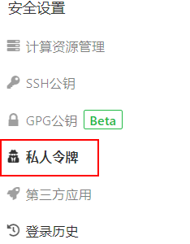
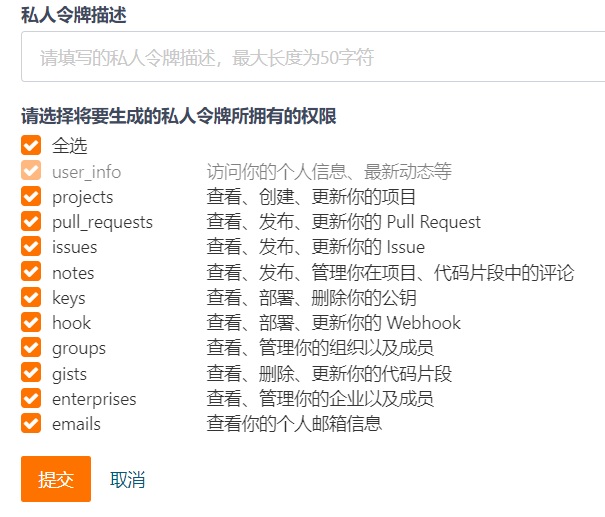
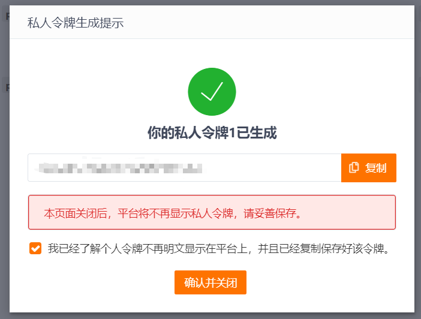
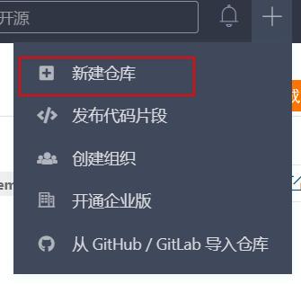
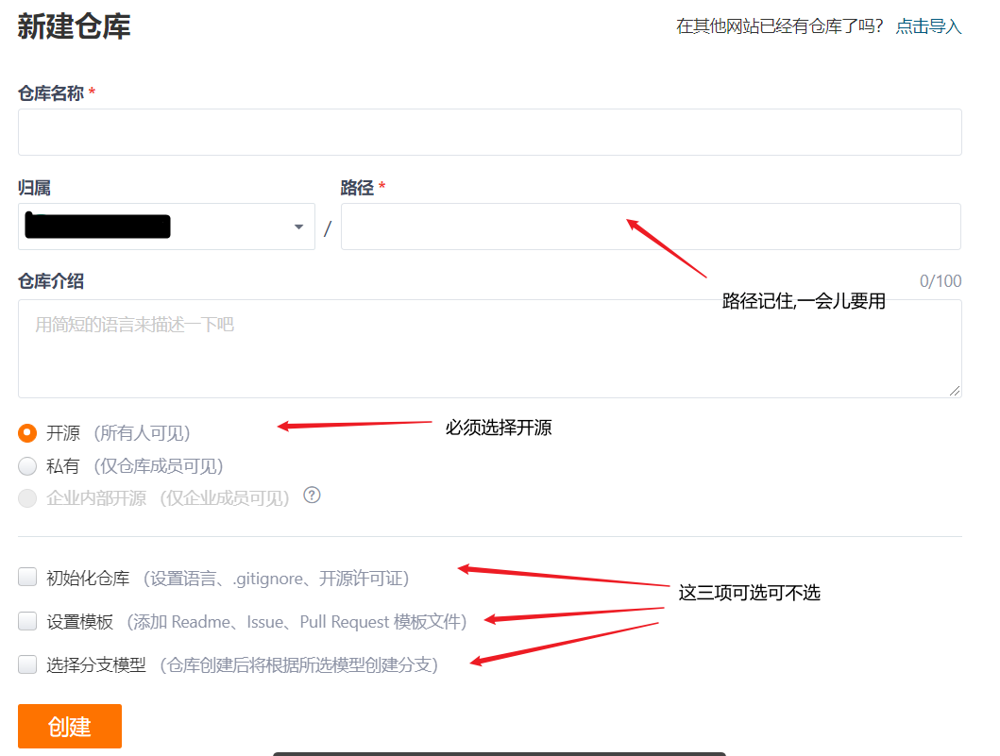
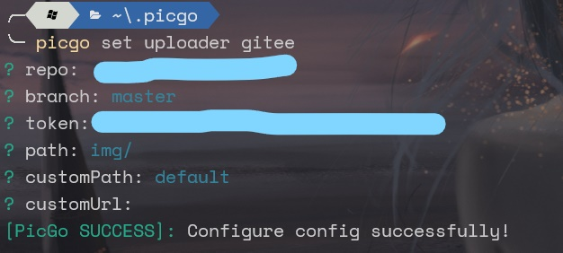
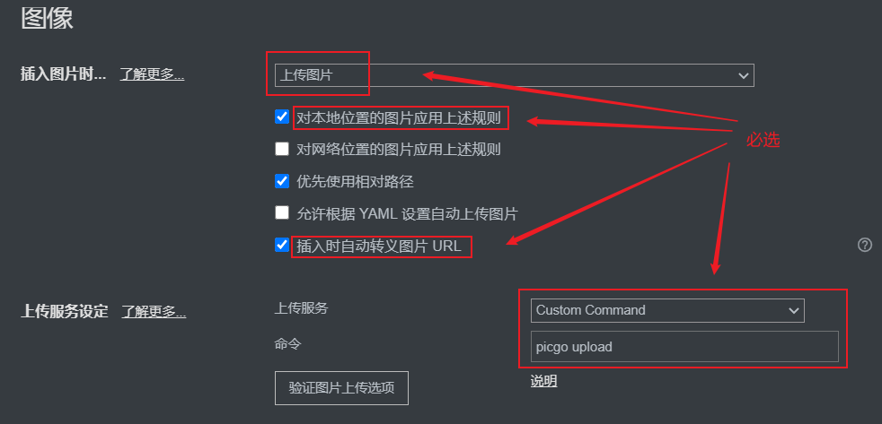
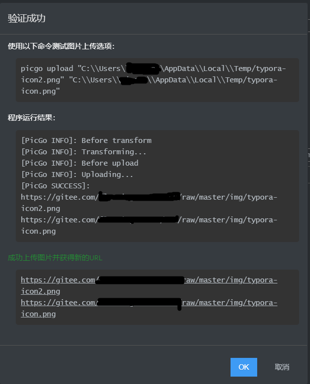

> 在初学markdown的过程中，图片的引用总是初学者头疼的事情，不同于word，在markdown的书写过程中，对于图片的插入其实是对于图片资源的引用，所以如果看文档的人无法访问图片资源，那么就会出现图片加载失败的情况，通常我们用图床工具来实现本地资源与网络资源的自动转换。以下就是在typora下用picgo-core配置图床的过程

## :house: ​gitee介绍

[Gitee（码云）](https://gitee.com)是开源中国社区推出的代码托管协作开发平台，支持Git[^1]和SVN，提供免费的私有仓库托管。与gihub相似，不同的就是它是国内的平台，对于访问速度自然是没得说的，在实际使用过程中也是如此，所以我在这里选用gitee仓库来作为我的图库

​    **注：至少了解git的基础指令，如果不了解可以去看看[廖雪峰的git教程](https://www.liaoxuefeng.com/wiki/896043488029600) 或 菜鸟教程的 [git教程](https://www.runoob.com/git/git-tutorial.html)**

## :framed_picture: picgo-core与picgo

**PicGo: 一个用于快速上传图片并获取图片 URL 链接的工具**

PicGo 本体支持如下图床：

- `七牛图床` v1.0
- `腾讯云 COS v4\v5 版本` v1.1 & v1.5.0
- `又拍云` v1.2.0
- `GitHub` v1.5.0
- `SM.MS V2` v2.3.0-beta.0
- `阿里云 OSS` v1.6.0
- `Imgur` v1.6.0


*可以看到 picgo支持的默认图床很多，如果不想将图床配置在gitee上，可以去看 PicGo的 [官方文档](https://picgo.github.io/PicGo-Doc/zh/) 自行配置*

[PicGo-Core](https://picgo.github.io/PicGo-Core-Doc/)是PicGo2.0版本里将会预置的底层核心组件。它可以看做是一个简单的上传流程系统。  
因为PicGo已不支持增加默认图床而默认图床中没有gitee，所以我们选用picgo-core来配置

如果想了解picgo-core的操作逻辑可以去看picgo-core官方文档的[介绍](https://picgo.github.io/PicGo-Core-Doc/zh/guide/#%E7%89%B9%E6%80%A7)

## :gear: 配置过程

1. 安装picgo_core

   ```powershell
   #安装
   npm install picgo-core -g #或者 yarn global add picgo
   ```

   使用 `picgo -v` 检查是否安装成功

2. 安装 `picgo-plugin-gitee-uploader`，为了上传到gitee

   ```powershell
   # 安装picgo-plugin-gitee-uploader
   picgo install picgo-plugin-gitee-uploader
   ```

   

3. 在gitee上申请一个私人令牌(token) ，在右上角有==生成新令牌==，权限自选，描述随便，最后复制生成的token

   ​                                                          

   

   

4. 在gitee生成一个仓库作为我们的图库

   

   

5. 配置插件

   - 可以直接在命令行配置

     ```powershell
     picgo set uploader gitee
     ```

     依次填入`repo`(刚才记得仓库路径)、`branch`(仓库分支,不想了解直接默认master)、`token`(私人令牌)、`path`(图片在仓库中的路径[^2])、`customPath`(目录下的保存方式[^3])、`customUrl`[^4]
   
     成功后如下所示
   
     
   
     之后再配置transformer
   
     ```powershell
     picgo set transformer path
     ```
   
   - 也可以直接配置json文件
   
     使用一种文本编辑器打开 `~/.picgo/config.json` 文件，推荐用 `VSCode`
   
     再`picBed`部分将其替换为以下代码(==注意==：`repo`和`token`项记得换为自己的repo和token)
   
     ```json
     "picBed": {
         "uploader": "gitee",
         "current": "gitee",
         "gitee": {
           "repo": "owner/repoName",
           "branch": "master",
           "token": "token",
           "path": "img/",
           "customPath": "default",
           "customUrl": ""
         },
         "transformer": "path"
     },
     ```

6. 至此你已完成picgo以及gitee的配置，现在打开typora，在偏好设置的图像里这样配置，之后验证图片上传

   

   出现这种情况说明配置成功

   

   ## :label: 插件推荐

   经过上面的配置过程，我们已经可以使picgo搭配typora使用而且可以在你插入本地路径的时候自动替换为URL，但我们还可以优化这个过程，下面我就推荐两个我正在使用的picgo插件

   - [picgo-plugin-compres](https://www.npmjs.com/package/picgo-plugin-compress)：一个压缩图片的插件，因为介绍都是中文的我就不说了，自己去看吧
   - [picgo-plugin-pic-migrater](https://www.npmjs.com/package/picgo-plugin-pic-migrater)：一个能将你markdown文件中的图片从一个图床迁移到另一个图床的插件，同样有中文

   除了上面这两个，还有许多有趣的插件，可以在[npm](https://www.npmjs.com)中搜索`picgo-plugin`前缀的包

[^1]: 一种版本控制工具，与CVS、Subversion一类的集中式版本控制工具不同，它采用了分布式版本库的作法，不需要服务器端软件，就可以运作版本控制，使得源代码的发布和交流极其方便。

[^2]: 这里的path是指图片在远端仓库中的保存路径,如: path:img/, 则在仓库中创建一个“img”的文件夹, 图片将保存在“img/”目录下
[^3]: 这里的customPath有三种保存方式: (1)default:不进行分类; (2)年:按年分类; (3)年季:按年与四季分类; (4)年月:按年和月分类
[^4]: 指转换后的url可以自定义为`${customUrl}/path/filename`, 代替`http://gitee.com/:owner/:repo/raw/:path/:filename`, 但需确保`${customUrl}`可以访问到你的仓库